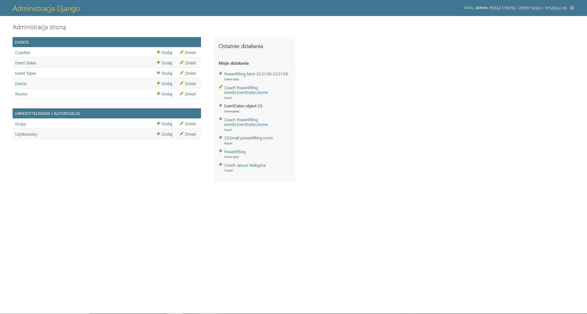

# Dokumentacja dla administratora/managera/recepcji

## Spis treści
- Wprowadzenie
- Słownik terminów
- Pierwsze kroki
- Moduł *'Auth'*
- Moduł *'Events'*
- Moduł *'Memberships'*

## Słownik Terminów
Słownik terminów używanych w dokumentacji aplikacji internetowej Elevate Fitness dalej zwanej programem.
- **panel zarządzania** - panel służący do tworzenia, modyfikowania oraz usuwania wpisów w bazie danych programu,domyślnie znajduje się na podstronie \admin\
- **pracownik** - użytkownik z prawami logowania do panelu zarządzania
- **superużytkownik** - personel z domyślnie nadanymi wszystkimi prawami
- **uwierzytelnianie** / **autentykacja** - czynność pozwalająca na potwierdzenie tożsamości użytkownika próbującego skorzystać z aplikacji, patrz [Moduł *'Auth'*](#moduł-auth)
- **autoryzacja** -  czynność pozwalająca na potwierdzenie uprawnień użytkownika próbującego wykonać jakąś czynność, patrz [Moduł *'Auth'*](#moduł-auth)

## Pierwsze Kroki
### Konfiguracja 
...

### Rozpoczęcie pracy z programem
W celu ropoczęcia pracy z programem należy utworzyć conajmniej jedno konto superużytkownika które będzie używane do dalszej konfiguracji.  
Aby to wykonać należy wywołać nastepujące polecenie:
>...\backend\gym> python manage.py createsuperuser  

Z zastrzeżeniem że powyższe polecenie należy wykonać w katalogu "gym" programu, w przypadku wykonania go z innym bieżącym katalogiem należy odpowiednio zmodyfikować ścieżki do poszczególnych zasobów.
Następnie należy uruchomić program poleceniem
>...\backend\gym> python manage.py createsuperuser  

i przejść na podstrone na której znajduję się panel zarządzania.  

W panelu zarządzania należy przejść do modułu "użytkownicy" oraz nacisnąć klawisz **Dodaj użytkownik**.

## Moduł *'Auth'*
## Moduł *'Events'*
## Moduł *'Memberships'*