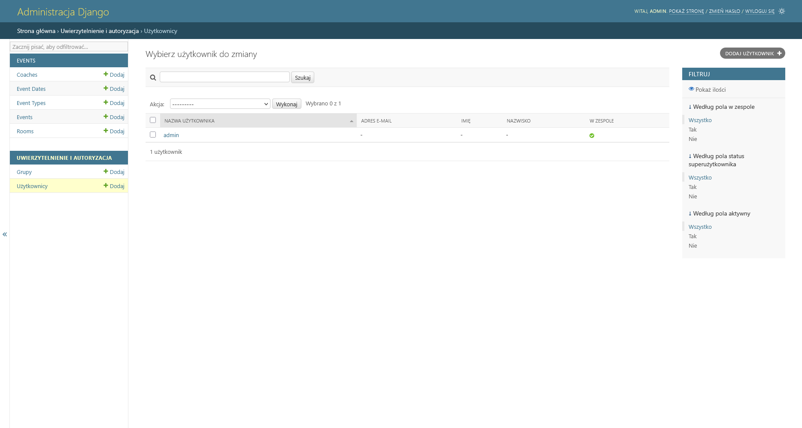
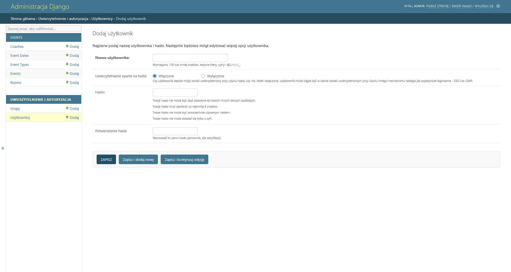
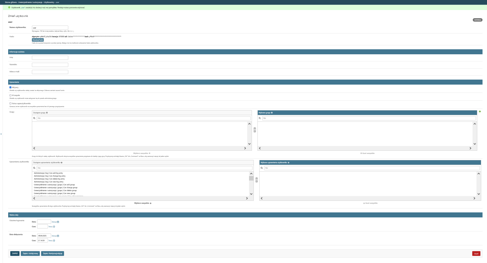

# Dokumentacja dla administratora/managera/recepcji

## Spis treści
- Wprowadzenie
- Słownik terminów
- Pierwsze kroki
- Moduł *'Auth'*
- Moduł *'Events'*
- Moduł *'Memberships'*

## Słownik Terminów
Słownik terminów używanych w dokumentacji aplikacji internetowej Elevate Fitness dalej zwanej programem.
- **panel administracyjny** - panel służący do tworzenia, modyfikowania oraz usuwania wpisów w bazie danych programu, domyślnie znajduje się na podstronie \admin\
- **pracownik** - użytkownik z prawami logowania do panelu administracyjny
- **superużytkownik** - pracownik z domyślnie nadanymi wszystkimi prawami
- **uwierzytelnianie** / **autentykacja** - czynność pozwalająca na potwierdzenie tożsamości użytkownika próbującego skorzystać z aplikacji, patrz [Moduł *'Auth'*](#moduł-auth)
- **autoryzacja** -  czynność pozwalająca na potwierdzenie uprawnień użytkownika próbującego wykonać jakąś czynność, patrz [Moduł *'Auth'*](#moduł-auth)
- **dodanie obiektu** - czynność poelgająca na dodaniu wpisu w bazie danych poprzez formularz dostępny w panelu administracyjny, patrz przykład dodania obiektu 'użytkownik' [Rozpoczęcie pracy z programem](#rozpoczęcie-pracy-z-programem)
## Pierwsze Kroki
### Konfiguracja 
...

### Rozpoczęcie pracy z programem
W celu ropoczęcia pracy z programem należy utworzyć conajmniej jedno konto superużytkownika które będzie używane do dalszej konfiguracji.  
Aby to wykonać należy wywołać nastepujące polecenie:
>...\backend\gym> python manage.py createsuperuser  

Z zastrzeżeniem że powyższe polecenie należy wykonać w katalogu "gym" programu, w przypadku wykonania go z innym bieżącym katalogiem należy odpowiednio zmodyfikować ścieżki do poszczególnych zasobów.
Następnie należy uruchomić program poleceniem
>...\backend\gym> python manage.py runserver  

i przejść na podstrone na której znajduję się panel administracyjny.  

W panelu administracyjny należy przejść do modułu "użytkownicy" oraz nacisnąć klawisz **Dodaj użytkownik**.

Następnie należy uzupełnić wszystkie wymagane dane i nacisnąć "Zapisz" jeżeli planujemy dodac tylko jednego użytkownika,  
"Zapisz i dodaj nowy" jezeli planujemy dodać więcej niż jednego,  
"Zapisz i kontynuuj edycję" jezeli chcemy zapisać bieżące postępy ale nie wyłączać panelu edycji użytkownika.  
  
***zastrzeżenie** jeżeli w dokumentacji mowa o dodaniu obiektu należy postępować podobnie jak w przypadku dodawania użytkownika*  

Po zapisaniu obiektu wyświetli się okienko modyfikacji dopiero co stworzonego obiektu (nie dotyczy to większości obiektów, niektóre obiekty mają tylko jeden - pierwszy formularz)  

  

Funkcjonalności poszczególnych pól są następujące:

- Adres e-mail - użytkownik będzie na niego dostawał ewentualne powiadomienia.
- Aktywny - przycisk pozwalający na wyłaczenie możliwości logowania danemu użytkownikowi tzw. soft delete
- W zespole - użytkownik może się logować do panelu administracyjnego, nadawać tylko pracowniką!
- Status superużytkownika - nadanie domyślnie wszystkich praw, NADAWAĆ Z ROZWAGĄ!
- Grupy - patrz [Moduł *'Auth'*](#moduł-auth)
- Uprawnienia - patrz [Moduł *'Auth'*](#moduł-auth)

## Moduł *'Auth'*
## Moduł *'Events'*
## Moduł *'Memberships'*